# UMKM Sight

**Sistem Prediksi & Analisis Stok UMKM Berbasis Mobile Application dengan Metode Time Series Forecasting & Automated Push Notification**

UMKM Sight adalah aplikasi mobile asisten cerdas untuk pemilik UMKM. Aplikasi menganalisis riwayat transaksi penjualan dengan model *Time Series Forecasting*, memproyeksikan kebutuhan stok 7 - 30 hari ke depan, dan mengirim *push notification* otomatis saat stok diprediksi habis, sehingga pemilik toko dapat melakukan restock sebelum terjadi *stockout*.

> Proyek PBL Semester 5. Dokumen ini berisi rancangan diagram UML berdasarkan *Proposal Produk PBL Sem 5 - UMKM Sight*.

## Daftar Isi

- [Fitur Utama](#fitur-utama)
- [Arsitektur & Teknologi](#arsitektur--teknologi)
- [Tim Pengembang](#tim-pengembang)
- [Diagram UML](#diagram-uml)
  - [1. Use Case Diagram](#1-use-case-diagram)
  - [2. ERD](#2-erd-entity-relationship-diagram)
  - [3. Sequence Diagram](#3-sequence-diagram)
  - [4. Activity Diagram](#4-activity-diagram)
  - [5. Class Diagram (Flutter)](#5-class-diagram-sisi-flutter)
- [Asumsi Perancangan](#asumsi-perancangan)
- [Struktur Repositori Dokumentasi](#struktur-repositori-dokumentasi)
- [Cara Melihat & Mengedit Diagram](#cara-melihat--mengedit-diagram)

## Fitur Utama

- **Peramalan kebutuhan stok** (fitur ML): angka proyeksi dan grafik estimasi kebutuhan barang.
- **Automated push notification**: pengingat restock otomatis saat stok mencapai ambang batas kritis.
- **Dasbor manajemen inventaris**: CRUD produk, pembaruan stok, dan riwayat mutasi stok.
- **Pencatatan transaksi penjualan**: sumber data deret waktu harian.
- **Autentikasi pengguna & profil toko**.

## Arsitektur & Teknologi

| Lapisan | Teknologi |
|---|---|
| Aplikasi mobile | Flutter (Dart), `go_router`, `flutter_bloc` / `riverpod`, `dio`, `sqflite`, `shared_preferences` |
| Backend API | Laravel (REST API) |
| Basis data | PostgreSQL |
| Layanan ML | Python / FastAPI (ARIMA / SARIMA, Prophet, LSTM-GRU) |
| Notifikasi | Firebase Cloud Messaging (FCM) |
| Dataset | [UCI Online Retail Dataset](https://archive.ics.uci.edu/dataset/352/online+retail) (541.909 transaksi) |

Target evaluasi model: **MAPE ≤ 20%** (serta RMSE dan MAE). Target performa API prediksi: **response time < 5 detik**.

## Tim Pengembang

| Nama | NIM | Peran |
|---|---|---|
| Muhammad Christiano Olyvian Barini | 244107020169 | Ketua Tim & QA/Penguji |
| Abdul Muid | 244107020006 | Pengembang Utama (Mobile App Flutter) |
| Farrel Andika Chandra | 244107020168 | ML Engineer & Arsitek Sistem (Backend) |
| Abelas Solihin | 244107020052 | Sekretaris & Dokumentator |

Mata kuliah terintegrasi: Pemrograman Mobile, Pembelajaran Mesin, dan Penjaminan Mutu Perangkat Lunak.

---

## Diagram UML

Use case dan activity diagram dibuat dengan **PlantUML** (notasi UML ketat) dan ditampilkan sebagai gambar; kodenya bisa dibuka pada bagian *Lihat kode PlantUML*. ERD, sequence, dan class diagram dibuat dengan **Mermaid** dan dirender langsung oleh GitHub.

### 1. Use Case Diagram

Aktor: **Pemilik UMKM** dan **Admin** (aktor primer), serta **Layanan ML**, **FCM**, dan **Penjadwal** (aktor sistem).


<details>
<summary>Lihat kode PlantUML</summary>

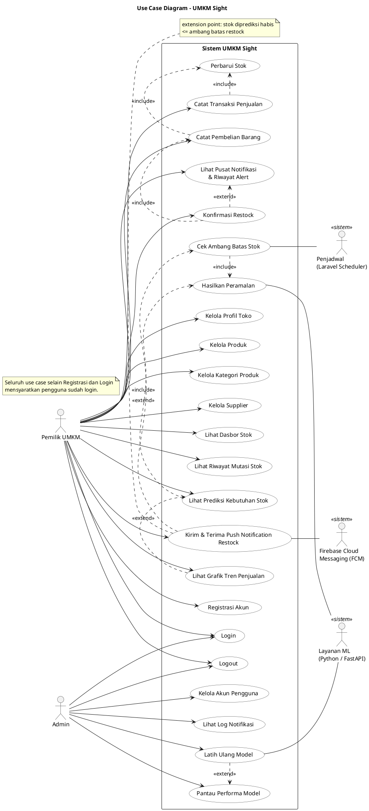
```plantuml
@startuml UseCase_UMKM_Sight
left to right direction
skinparam packageStyle rectangle
skinparam shadowing false
skinparam usecase {
  BackgroundColor #FFFFFF
  BorderColor #333333
}
title Use Case Diagram - UMKM Sight

actor "Pemilik UMKM" as Owner
actor "Admin" as Admin
actor "Layanan ML\n(Python / FastAPI)" as ML <<sistem>>
actor "Firebase Cloud\nMessaging (FCM)" as FCM <<sistem>>
actor "Penjadwal\n(Laravel Scheduler)" as Sched <<sistem>>

rectangle "Sistem UMKM Sight" {
  usecase "Registrasi Akun" as UC01
  usecase "Login" as UC02
  usecase "Logout" as UC03
  usecase "Kelola Profil Toko" as UC04

  usecase "Kelola Produk" as UC05
  usecase "Kelola Kategori Produk" as UC06
  usecase "Kelola Supplier" as UC07
  usecase "Catat Transaksi Penjualan" as UC08
  usecase "Catat Pembelian Barang" as UC09
  usecase "Perbarui Stok" as UC10
  usecase "Lihat Dasbor Stok" as UC11
  usecase "Lihat Riwayat Mutasi Stok" as UC12

  usecase "Lihat Prediksi Kebutuhan Stok" as UC13
  usecase "Lihat Grafik Tren Penjualan" as UC14
  usecase "Hasilkan Peramalan" as UC15

  usecase "Cek Ambang Batas Stok" as UC16
  usecase "Kirim & Terima Push Notification\nRestock" as UC17
  usecase "Lihat Pusat Notifikasi\n& Riwayat Alert" as UC18
  usecase "Konfirmasi Restock" as UC19

  usecase "Kelola Akun Pengguna" as UC20
  usecase "Pantau Performa Model" as UC21
  usecase "Latih Ulang Model" as UC22
  usecase "Lihat Log Notifikasi" as UC23
}

' --- Asosiasi Pemilik UMKM ---
Owner --> UC01
Owner --> UC02
Owner --> UC03
Owner --> UC04
Owner --> UC05
Owner --> UC06
Owner --> UC07
Owner --> UC08
Owner --> UC09
Owner --> UC11
Owner --> UC12
Owner --> UC13
Owner --> UC14
Owner --> UC17
Owner --> UC18
Owner --> UC19

' --- Asosiasi Admin ---
Admin --> UC02
Admin --> UC03
Admin --> UC20
Admin --> UC21
Admin --> UC22
Admin --> UC23

' --- Asosiasi aktor sistem ---
UC15 -- ML
UC22 -- ML
UC16 -- Sched
UC17 -- FCM

' --- Relasi include ---
UC08 .> UC10 : <<include>>
UC09 .> UC10 : <<include>>
UC19 .> UC09 : <<include>>
UC13 .> UC15 : <<include>>
UC16 .> UC15 : <<include>>

' --- Relasi extend (panah dari use case ekstensi ke use case dasar) ---
UC17 .> UC16 : <<extend>>
UC19 .> UC18 : <<extend>>
UC14 .> UC13 : <<extend>>
UC22 .> UC21 : <<extend>>

note bottom of UC17
  extension point: stok diprediksi habis
  <= ambang batas restock
end note

note "Seluruh use case selain Registrasi dan Login\nmensyaratkan pengguna sudah login." as N1
@enduml
```

</details>

Panah `«extend»` menunjuk dari use case ekstensi ke use case dasar; panah `«include»` dari use case dasar ke use case yang disertakan. Seluruh use case selain Registrasi dan Login mensyaratkan pengguna sudah login.

### 2. ERD (Entity Relationship Diagram)

Rancangan basis data PostgreSQL. Kolom `role` pada USERS membedakan OWNER dan ADMIN; Admin tidak memiliki toko, sehingga relasi USERS ke STORES adalah 1 : 0..1. Tabel `ML_MODELS` mencatat model peramalan yang aktif beserta metrik evaluasinya.

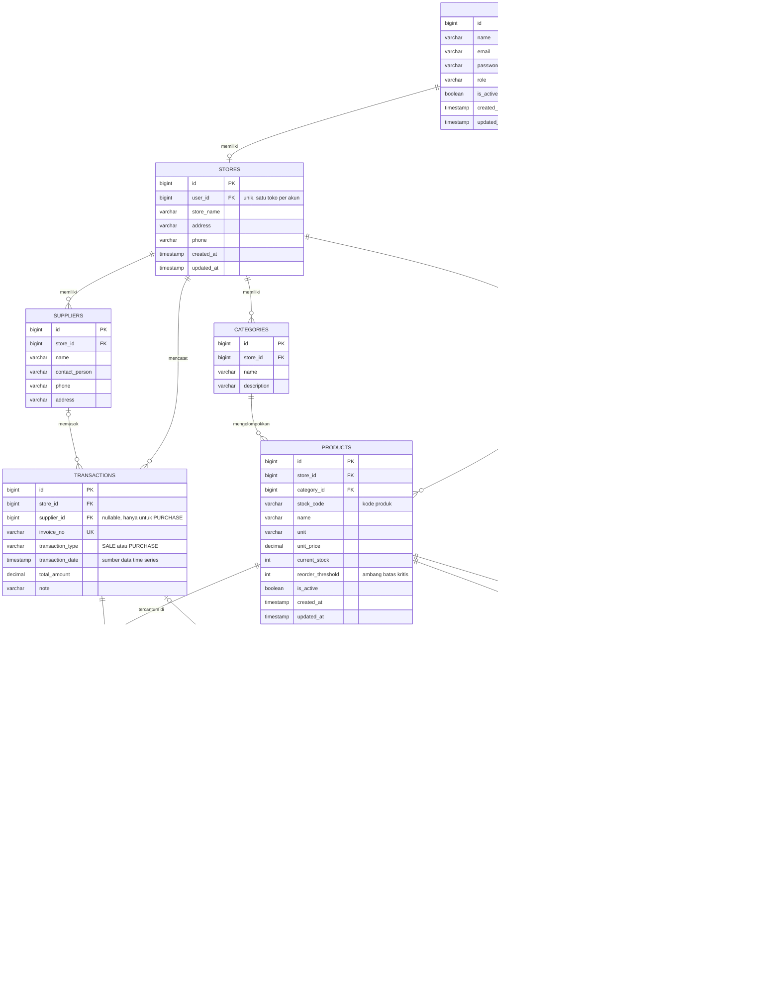
```mermaid
erDiagram
    USERS ||--o| STORES : "memiliki"
    USERS ||--o{ DEVICE_TOKENS : "mendaftarkan"
    USERS ||--o{ NOTIFICATIONS : "menerima"
    STORES ||--o{ CATEGORIES : "memiliki"
    STORES ||--o{ SUPPLIERS : "memiliki"
    STORES ||--o{ PRODUCTS : "mengelola"
    STORES ||--o{ TRANSACTIONS : "mencatat"
    CATEGORIES ||--o{ PRODUCTS : "mengelompokkan"
    SUPPLIERS |o--o{ TRANSACTIONS : "memasok"
    TRANSACTIONS ||--|{ TRANSACTION_ITEMS : "terdiri dari"
    PRODUCTS ||--o{ TRANSACTION_ITEMS : "tercantum di"
    PRODUCTS ||--o{ STOCK_MOVEMENTS : "mengalami"
    TRANSACTIONS |o--o{ STOCK_MOVEMENTS : "menyebabkan"
    PRODUCTS ||--o{ FORECASTS : "diramalkan"
    ML_MODELS ||--o{ FORECASTS : "menghasilkan"
    FORECASTS ||--|{ FORECAST_DETAILS : "memiliki"
    PRODUCTS ||--o{ NOTIFICATIONS : "menjadi subjek"
    FORECASTS |o--o{ NOTIFICATIONS : "memicu"

    USERS {
        bigint id PK
        varchar name
        varchar email UK
        varchar password
        varchar role "OWNER atau ADMIN"
        boolean is_active
        timestamp created_at
        timestamp updated_at
    }

    STORES {
        bigint id PK
        bigint user_id FK "unik, satu toko per akun"
        varchar store_name
        varchar address
        varchar phone
        timestamp created_at
        timestamp updated_at
    }

    DEVICE_TOKENS {
        bigint id PK
        bigint user_id FK
        varchar fcm_token UK
        varchar platform "android"
        timestamp last_active_at
    }

    CATEGORIES {
        bigint id PK
        bigint store_id FK
        varchar name
        varchar description
    }

    SUPPLIERS {
        bigint id PK
        bigint store_id FK
        varchar name
        varchar contact_person
        varchar phone
        varchar address
    }

    PRODUCTS {
        bigint id PK
        bigint store_id FK
        bigint category_id FK
        varchar stock_code "kode produk"
        varchar name
        varchar unit
        decimal unit_price
        int current_stock
        int reorder_threshold "ambang batas kritis"
        boolean is_active
        timestamp created_at
        timestamp updated_at
    }

    TRANSACTIONS {
        bigint id PK
        bigint store_id FK
        bigint supplier_id FK "nullable, hanya untuk PURCHASE"
        varchar invoice_no UK
        varchar transaction_type "SALE atau PURCHASE"
        timestamp transaction_date "sumber data time series"
        decimal total_amount
        varchar note
    }

    TRANSACTION_ITEMS {
        bigint id PK
        bigint transaction_id FK
        bigint product_id FK
        int quantity
        decimal unit_price
        decimal subtotal
    }

    STOCK_MOVEMENTS {
        bigint id PK
        bigint product_id FK
        bigint transaction_id FK "nullable"
        varchar movement_type "IN, OUT, ADJUSTMENT"
        int quantity
        int stock_before
        int stock_after
        varchar note
        timestamp created_at
    }

    ML_MODELS {
        bigint id PK
        varchar name
        varchar version
        varchar algorithm "ARIMA, SARIMA, Prophet, LSTM"
        decimal mape
        decimal rmse
        decimal mae
        boolean is_active
        timestamp trained_at
    }

    FORECASTS {
        bigint id PK
        bigint product_id FK
        bigint ml_model_id FK
        int horizon_days "7 sampai 30"
        int days_until_stockout
        timestamp generated_at
    }

    FORECAST_DETAILS {
        bigint id PK
        bigint forecast_id FK
        date forecast_date
        decimal predicted_qty
        decimal lower_bound
        decimal upper_bound
    }

    NOTIFICATIONS {
        bigint id PK
        bigint user_id FK
        bigint product_id FK
        bigint forecast_id FK "nullable"
        varchar type "RESTOCK_ALERT"
        varchar title
        varchar message
        boolean is_read
        timestamp sent_at
        timestamp read_at
    }
```

---

### 3. Sequence Diagram

#### 3.1 Login & Registrasi Token Perangkat

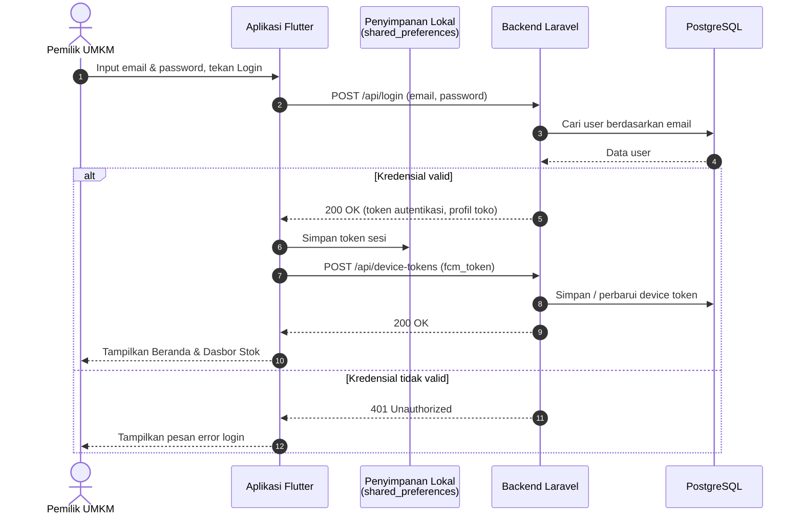
```mermaid
sequenceDiagram
    autonumber
    actor U as Pemilik UMKM
    participant APP as Aplikasi Flutter
    participant LS as Penyimpanan Lokal<br/>(shared_preferences)
    participant API as Backend Laravel
    participant DB as PostgreSQL

    U->>APP: Input email & password, tekan Login
    APP->>API: POST /api/login (email, password)
    API->>DB: Cari user berdasarkan email
    DB-->>API: Data user
    alt Kredensial valid
        API-->>APP: 200 OK (token autentikasi, profil toko)
        APP->>LS: Simpan token sesi
        APP->>API: POST /api/device-tokens (fcm_token)
        API->>DB: Simpan / perbarui device token
        API-->>APP: 200 OK
        APP-->>U: Tampilkan Beranda & Dasbor Stok
    else Kredensial tidak valid
        API-->>APP: 401 Unauthorized
        APP-->>U: Tampilkan pesan error login
    end
```

#### 3.2 Pencatatan Transaksi Penjualan

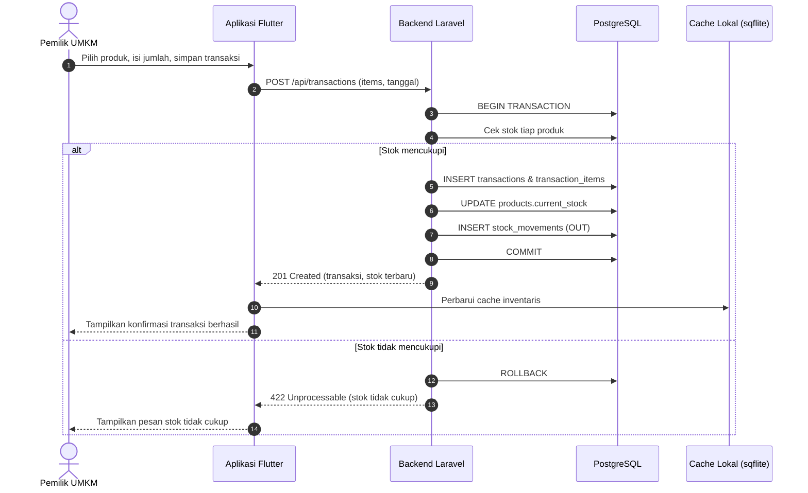
```mermaid
sequenceDiagram
    autonumber
    actor U as Pemilik UMKM
    participant APP as Aplikasi Flutter
    participant API as Backend Laravel
    participant DB as PostgreSQL
    participant CACHE as Cache Lokal (sqflite)

    U->>APP: Pilih produk, isi jumlah, simpan transaksi
    APP->>API: POST /api/transactions (items, tanggal)
    API->>DB: BEGIN TRANSACTION
    API->>DB: Cek stok tiap produk
    alt Stok mencukupi
        API->>DB: INSERT transactions & transaction_items
        API->>DB: UPDATE products.current_stock
        API->>DB: INSERT stock_movements (OUT)
        API->>DB: COMMIT
        API-->>APP: 201 Created (transaksi, stok terbaru)
        APP->>CACHE: Perbarui cache inventaris
        APP-->>U: Tampilkan konfirmasi transaksi berhasil
    else Stok tidak mencukupi
        API->>DB: ROLLBACK
        API-->>APP: 422 Unprocessable (stok tidak cukup)
        APP-->>U: Tampilkan pesan stok tidak cukup
    end
```

#### 3.3 Melihat Analitik & Prediksi Kebutuhan Stok

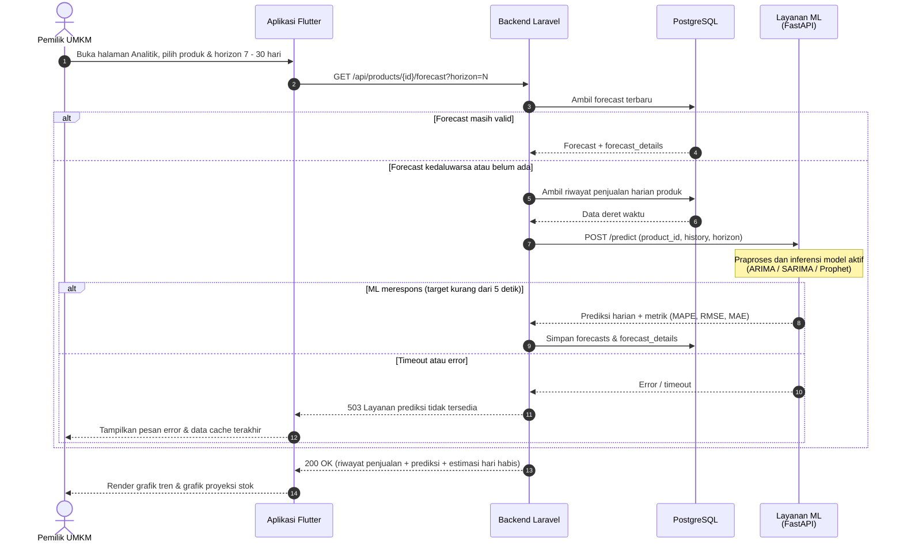
```mermaid
sequenceDiagram
    autonumber
    actor U as Pemilik UMKM
    participant APP as Aplikasi Flutter
    participant API as Backend Laravel
    participant DB as PostgreSQL
    participant ML as Layanan ML<br/>(FastAPI)

    U->>APP: Buka halaman Analitik, pilih produk & horizon 7 - 30 hari
    APP->>API: GET /api/products/{id}/forecast?horizon=N
    API->>DB: Ambil forecast terbaru
    alt Forecast masih valid
        DB-->>API: Forecast + forecast_details
    else Forecast kedaluwarsa atau belum ada
        API->>DB: Ambil riwayat penjualan harian produk
        DB-->>API: Data deret waktu
        API->>ML: POST /predict (product_id, history, horizon)
        Note over ML: Praproses dan inferensi model aktif<br/>(ARIMA / SARIMA / Prophet)
        alt ML merespons (target kurang dari 5 detik)
            ML-->>API: Prediksi harian + metrik (MAPE, RMSE, MAE)
            API->>DB: Simpan forecasts & forecast_details
        else Timeout atau error
            ML-->>API: Error / timeout
            API-->>APP: 503 Layanan prediksi tidak tersedia
            APP-->>U: Tampilkan pesan error & data cache terakhir
        end
    end
    API-->>APP: 200 OK (riwayat penjualan + prediksi + estimasi hari habis)
    APP-->>U: Render grafik tren & grafik proyeksi stok
```

#### 3.4 Automated Push Notification & Konfirmasi Restock

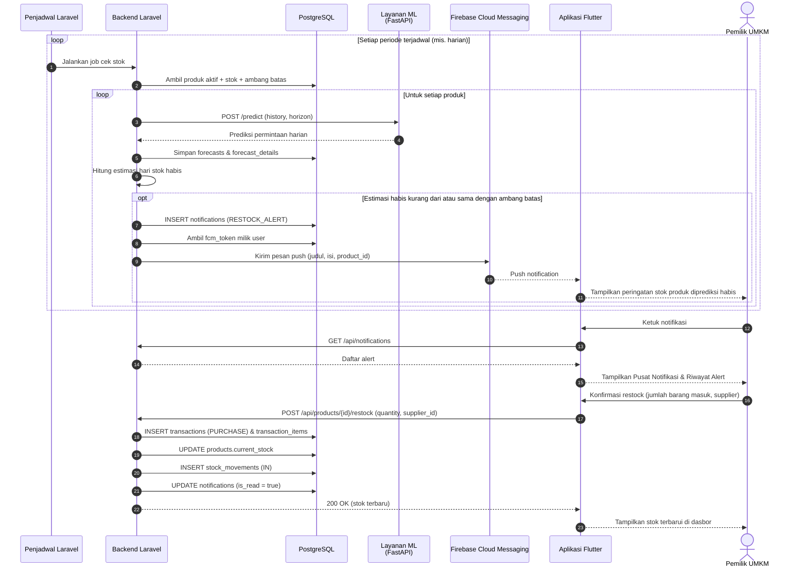
```mermaid
sequenceDiagram
    autonumber
    participant SCH as Penjadwal Laravel
    participant API as Backend Laravel
    participant DB as PostgreSQL
    participant ML as Layanan ML<br/>(FastAPI)
    participant FCM as Firebase Cloud Messaging
    participant APP as Aplikasi Flutter
    actor U as Pemilik UMKM

    loop Setiap periode terjadwal (mis. harian)
        SCH->>API: Jalankan job cek stok
        API->>DB: Ambil produk aktif + stok + ambang batas
        loop Untuk setiap produk
            API->>ML: POST /predict (history, horizon)
            ML-->>API: Prediksi permintaan harian
            API->>DB: Simpan forecasts & forecast_details
            API->>API: Hitung estimasi hari stok habis
            opt Estimasi habis kurang dari atau sama dengan ambang batas
                API->>DB: INSERT notifications (RESTOCK_ALERT)
                API->>DB: Ambil fcm_token milik user
                API->>FCM: Kirim pesan push (judul, isi, product_id)
                FCM-->>APP: Push notification
                APP-->>U: Tampilkan peringatan stok produk diprediksi habis
            end
        end
    end

    U->>APP: Ketuk notifikasi
    APP->>API: GET /api/notifications
    API-->>APP: Daftar alert
    APP-->>U: Tampilkan Pusat Notifikasi & Riwayat Alert
    U->>APP: Konfirmasi restock (jumlah barang masuk, supplier)
    APP->>API: POST /api/products/{id}/restock (quantity, supplier_id)
    API->>DB: INSERT transactions (PURCHASE) & transaction_items
    API->>DB: UPDATE products.current_stock
    API->>DB: INSERT stock_movements (IN)
    API->>DB: UPDATE notifications (is_read = true)
    API-->>APP: 200 OK (stok terbaru)
    APP-->>U: Tampilkan stok terbarui di dasbor
```

#### 3.5 Admin: Pantau & Latih Ulang Model

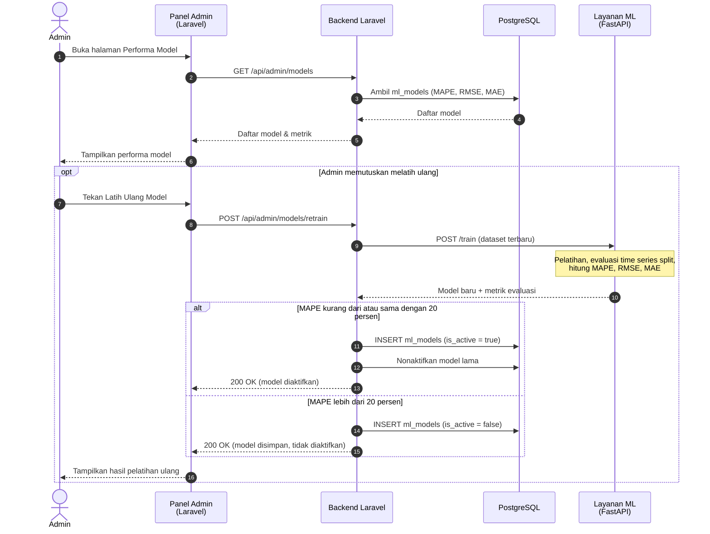
```mermaid
sequenceDiagram
    autonumber
    actor A as Admin
    participant ADM as Panel Admin<br/>(Laravel)
    participant API as Backend Laravel
    participant DB as PostgreSQL
    participant ML as Layanan ML<br/>(FastAPI)

    A->>ADM: Buka halaman Performa Model
    ADM->>API: GET /api/admin/models
    API->>DB: Ambil ml_models (MAPE, RMSE, MAE)
    DB-->>API: Daftar model
    API-->>ADM: Daftar model & metrik
    ADM-->>A: Tampilkan performa model
    opt Admin memutuskan melatih ulang
        A->>ADM: Tekan Latih Ulang Model
        ADM->>API: POST /api/admin/models/retrain
        API->>ML: POST /train (dataset terbaru)
        Note over ML: Pelatihan, evaluasi time series split,<br/>hitung MAPE, RMSE, MAE
        ML-->>API: Model baru + metrik evaluasi
        alt MAPE kurang dari atau sama dengan 20 persen
            API->>DB: INSERT ml_models (is_active = true)
            API->>DB: Nonaktifkan model lama
            API-->>ADM: 200 OK (model diaktifkan)
        else MAPE lebih dari 20 persen
            API->>DB: INSERT ml_models (is_active = false)
            API-->>ADM: 200 OK (model disimpan, tidak diaktifkan)
        end
        ADM-->>A: Tampilkan hasil pelatihan ulang
    end
```

### 4. Activity Diagram

Satu diagram per use case utama, ditambah alur otomatis sistem dan pipeline ML.

#### 4.1 Login


<details>
<summary>Lihat kode PlantUML</summary>

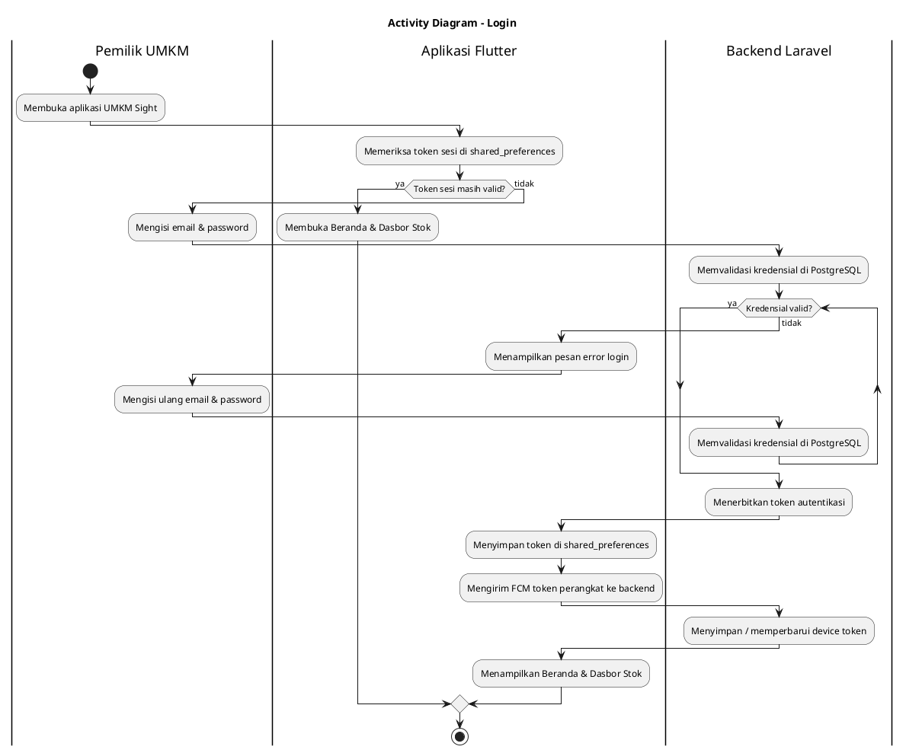
```plantuml
@startuml Activity_Login
title Activity Diagram - Login
skinparam shadowing false
|Pemilik UMKM|
start
:Membuka aplikasi UMKM Sight;
|Aplikasi Flutter|
:Memeriksa token sesi di shared_preferences;
if (Token sesi masih valid?) then (ya)
  :Membuka Beranda & Dasbor Stok;
else (tidak)
  |Pemilik UMKM|
  :Mengisi email & password;
  |Backend Laravel|
  :Memvalidasi kredensial di PostgreSQL;
  while (Kredensial valid?) is (tidak)
    |Aplikasi Flutter|
    :Menampilkan pesan error login;
    |Pemilik UMKM|
    :Mengisi ulang email & password;
    |Backend Laravel|
    :Memvalidasi kredensial di PostgreSQL;
  endwhile (ya)
  :Menerbitkan token autentikasi;
  |Aplikasi Flutter|
  :Menyimpan token di shared_preferences;
  :Mengirim FCM token perangkat ke backend;
  |Backend Laravel|
  :Menyimpan / memperbarui device token;
  |Aplikasi Flutter|
  :Menampilkan Beranda & Dasbor Stok;
endif
stop
@enduml
```

</details>

#### 4.2 Catat Transaksi Penjualan

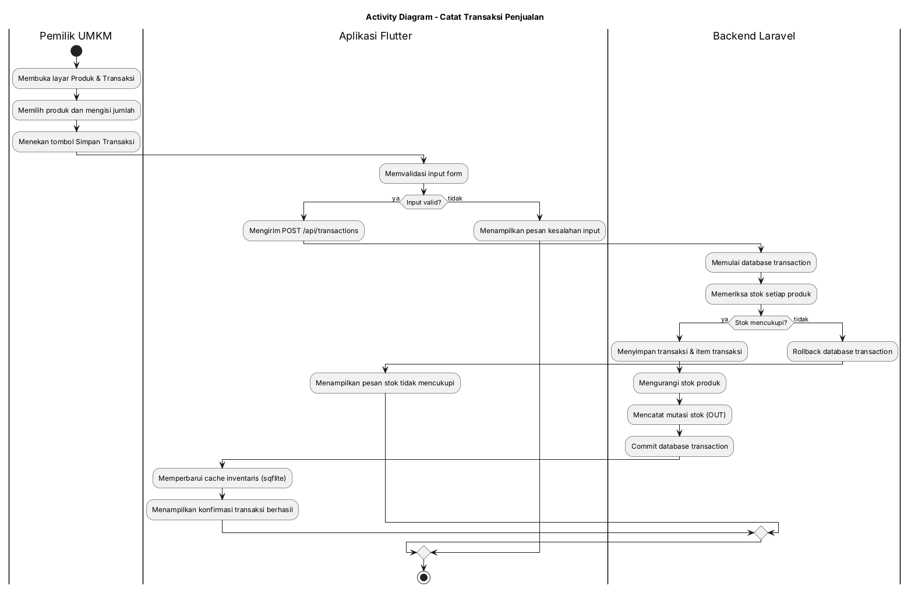

<details>
<summary>Lihat kode PlantUML</summary>

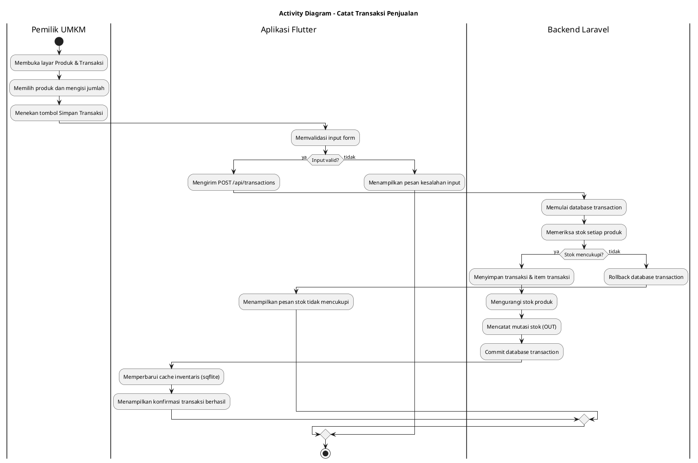
```plantuml
@startuml Activity_Catat_Transaksi
title Activity Diagram - Catat Transaksi Penjualan
skinparam shadowing false
|Pemilik UMKM|
start
:Membuka layar Produk & Transaksi;
:Memilih produk dan mengisi jumlah;
:Menekan tombol Simpan Transaksi;
|Aplikasi Flutter|
:Memvalidasi input form;
if (Input valid?) then (ya)
  :Mengirim POST /api/transactions;
  |Backend Laravel|
  :Memulai database transaction;
  :Memeriksa stok setiap produk;
  if (Stok mencukupi?) then (ya)
    :Menyimpan transaksi & item transaksi;
    :Mengurangi stok produk;
    :Mencatat mutasi stok (OUT);
    :Commit database transaction;
    |Aplikasi Flutter|
    :Memperbarui cache inventaris (sqflite);
    :Menampilkan konfirmasi transaksi berhasil;
  else (tidak)
    |Backend Laravel|
    :Rollback database transaction;
    |Aplikasi Flutter|
    :Menampilkan pesan stok tidak mencukupi;
  endif
else (tidak)
  :Menampilkan pesan kesalahan input;
endif
stop
@enduml
```

</details>

#### 4.3 Lihat Prediksi Kebutuhan Stok

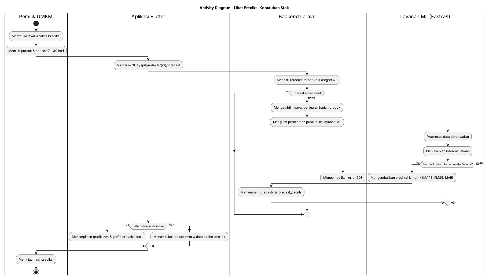

<details>
<summary>Lihat kode PlantUML</summary>

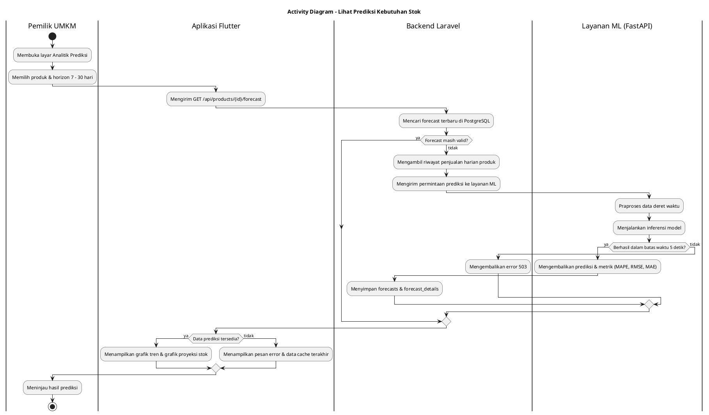
```plantuml
@startuml Activity_Lihat_Prediksi
title Activity Diagram - Lihat Prediksi Kebutuhan Stok
skinparam shadowing false
|Pemilik UMKM|
start
:Membuka layar Analitik Prediksi;
:Memilih produk & horizon 7 - 30 hari;
|Aplikasi Flutter|
:Mengirim GET /api/products/{id}/forecast;
|Backend Laravel|
:Mencari forecast terbaru di PostgreSQL;
if (Forecast masih valid?) then (ya)
else (tidak)
  :Mengambil riwayat penjualan harian produk;
  :Mengirim permintaan prediksi ke layanan ML;
  |Layanan ML (FastAPI)|
  :Praproses data deret waktu;
  :Menjalankan inferensi model;
  if (Berhasil dalam batas waktu 5 detik?) then (ya)
    :Mengembalikan prediksi & metrik (MAPE, RMSE, MAE);
    |Backend Laravel|
    :Menyimpan forecasts & forecast_details;
  else (tidak)
    |Backend Laravel|
    :Mengembalikan error 503;
  endif
endif
|Aplikasi Flutter|
if (Data prediksi tersedia?) then (ya)
  :Menampilkan grafik tren & grafik proyeksi stok;
else (tidak)
  :Menampilkan pesan error & data cache terakhir;
endif
|Pemilik UMKM|
:Meninjau hasil prediksi;
stop
@enduml
```

</details>

#### 4.4 Menerima Alert & Konfirmasi Restock


<details>
<summary>Lihat kode PlantUML</summary>

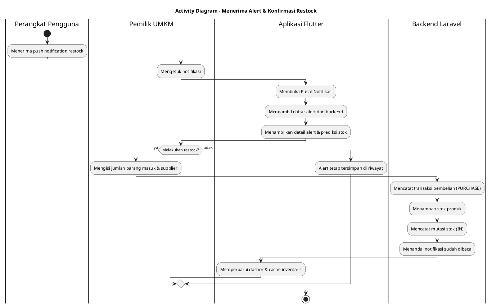
```plantuml
@startuml Activity_Konfirmasi_Restock
title Activity Diagram - Menerima Alert & Konfirmasi Restock
skinparam shadowing false
|Perangkat Pengguna|
start
:Menerima push notification restock;
|Pemilik UMKM|
:Mengetuk notifikasi;
|Aplikasi Flutter|
:Membuka Pusat Notifikasi;
:Mengambil daftar alert dari backend;
:Menampilkan detail alert & prediksi stok;
|Pemilik UMKM|
if (Melakukan restock?) then (ya)
  :Mengisi jumlah barang masuk & supplier;
  |Backend Laravel|
  :Mencatat transaksi pembelian (PURCHASE);
  :Menambah stok produk;
  :Mencatat mutasi stok (IN);
  :Menandai notifikasi sudah dibaca;
  |Aplikasi Flutter|
  :Memperbarui dasbor & cache inventaris;
else (tidak)
  |Aplikasi Flutter|
  :Alert tetap tersimpan di riwayat;
endif
stop
@enduml
```

</details>

#### 4.5 Peramalan & Automated Push Notification (Sistem)

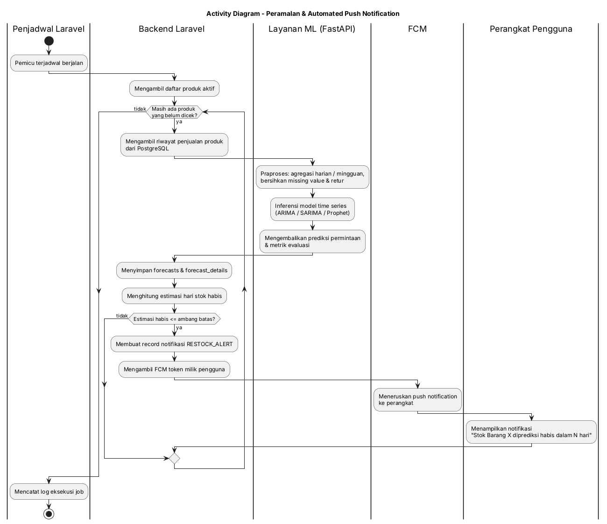

<details>
<summary>Lihat kode PlantUML</summary>

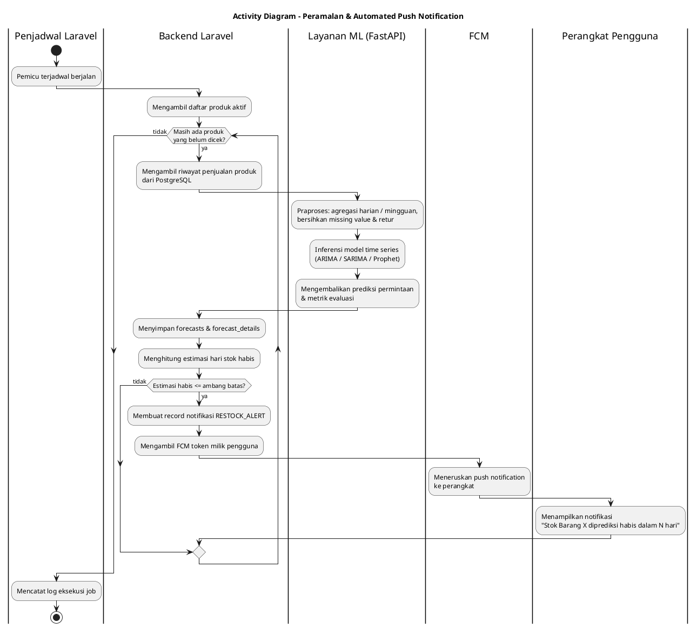
```plantuml
@startuml Activity_Peramalan_Notifikasi_Otomatis
title Activity Diagram - Peramalan & Automated Push Notification
skinparam shadowing false
|Penjadwal Laravel|
start
:Pemicu terjadwal berjalan;
|Backend Laravel|
:Mengambil daftar produk aktif;
while (Masih ada produk\nyang belum dicek?) is (ya)
  :Mengambil riwayat penjualan produk\ndari PostgreSQL;
  |Layanan ML (FastAPI)|
  :Praproses: agregasi harian / mingguan,\nbersihkan missing value & retur;
  :Inferensi model time series\n(ARIMA / SARIMA / Prophet);
  :Mengembalikan prediksi permintaan\n& metrik evaluasi;
  |Backend Laravel|
  :Menyimpan forecasts & forecast_details;
  :Menghitung estimasi hari stok habis;
  if (Estimasi habis <= ambang batas?) then (ya)
    :Membuat record notifikasi RESTOCK_ALERT;
    :Mengambil FCM token milik pengguna;
    |FCM|
    :Meneruskan push notification\nke perangkat;
    |Perangkat Pengguna|
    :Menampilkan notifikasi\n"Stok Barang X diprediksi habis dalam N hari";
    |Backend Laravel|
  else (tidak)
  endif
endwhile (tidak)
|Penjadwal Laravel|
:Mencatat log eksekusi job;
stop
@enduml
```

</details>

#### 4.6 Pipeline Machine Learning Time Series Forecasting


<details>
<summary>Lihat kode PlantUML</summary>

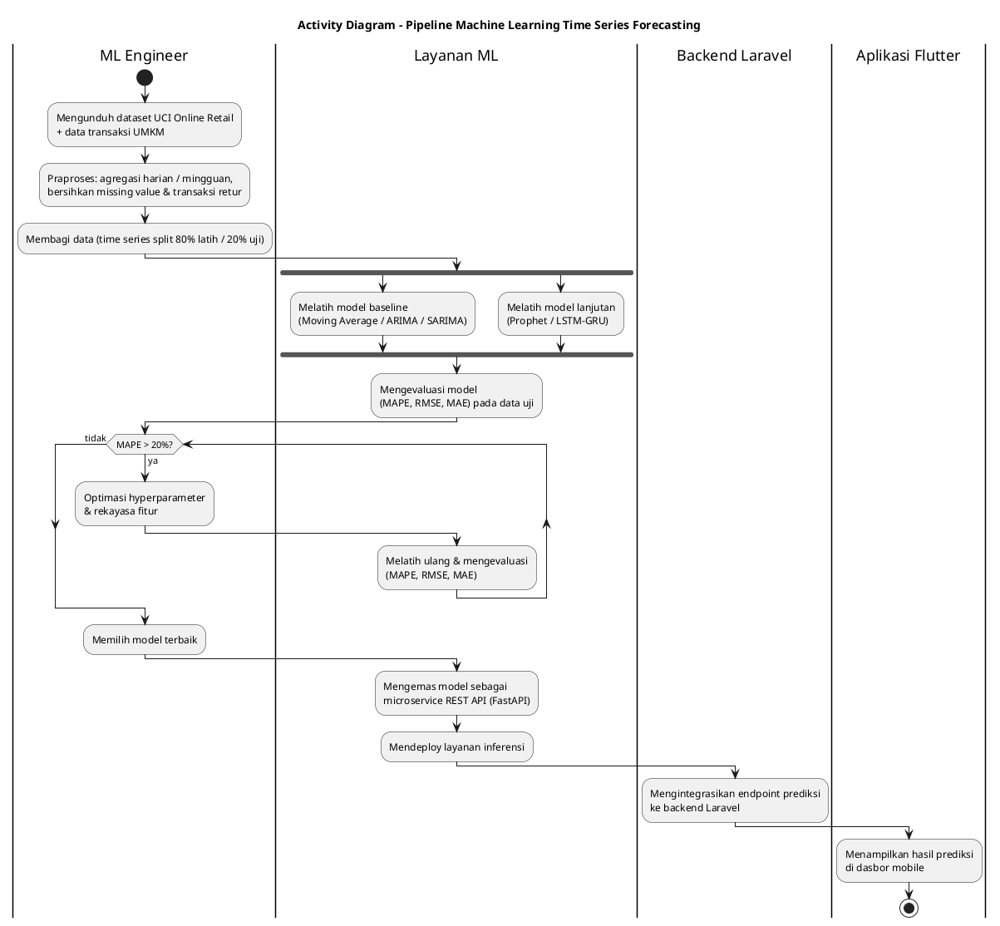
```plantuml
@startuml Activity_Pipeline_ML
title Activity Diagram - Pipeline Machine Learning Time Series Forecasting
skinparam shadowing false
|ML Engineer|
start
:Mengunduh dataset UCI Online Retail\n+ data transaksi UMKM;
:Praproses: agregasi harian / mingguan,\nbersihkan missing value & transaksi retur;
:Membagi data (time series split 80% latih / 20% uji);
|Layanan ML|
fork
  :Melatih model baseline\n(Moving Average / ARIMA / SARIMA);
fork again
  :Melatih model lanjutan\n(Prophet / LSTM-GRU);
end fork
:Mengevaluasi model\n(MAPE, RMSE, MAE) pada data uji;
|ML Engineer|
while (MAPE > 20%?) is (ya)
  :Optimasi hyperparameter\n& rekayasa fitur;
  |Layanan ML|
  :Melatih ulang & mengevaluasi\n(MAPE, RMSE, MAE);
  |ML Engineer|
endwhile (tidak)
:Memilih model terbaik;
|Layanan ML|
:Mengemas model sebagai\nmicroservice REST API (FastAPI);
:Mendeploy layanan inferensi;
|Backend Laravel|
:Mengintegrasikan endpoint prediksi\nke backend Laravel;
|Aplikasi Flutter|
:Menampilkan hasil prediksi\ndi dasbor mobile;
stop
@enduml
```

</details>

### 5. Class Diagram Sisi Flutter

Arsitektur berlapis sesuai proposal: UI + go_router, state management BLoC, repository, data source (Dio, sqflite, shared_preferences) dan model. Pola Event/State digambarkan lengkap untuk `ForecastBloc` sebagai contoh, dan pola yang sama berlaku untuk bloc lainnya.


```mermaid
classDiagram
    direction TB

    namespace Routing {
        class AppRouter {
            +GoRouter router
            +redirect(state) String
        }
    }

    namespace Presentation {
        class LoginScreen {
            <<Widget>>
            +build(context) Widget
        }
        class HomeDashboardScreen {
            <<Widget>>
            +build(context) Widget
        }
        class ForecastAnalyticsScreen {
            <<Widget>>
            +build(context) Widget
        }
        class ProductTransactionScreen {
            <<Widget>>
            +build(context) Widget
        }
        class NotificationCenterScreen {
            <<Widget>>
            +build(context) Widget
        }
        class ForecastChart {
            <<Widget>>
            +ForecastModel forecast
            +List~double~ history
            +build(context) Widget
        }
    }

    namespace StateManagement {
        class Bloc {
            <<abstract>>
            +add(event) void
            +emit(state) void
        }
        class AuthBloc {
            +AuthRepository authRepository
            -onSessionChecked(event, emit) void
            -onLoginRequested(event, emit) void
            -onRegisterRequested(event, emit) void
            -onLogoutRequested(event, emit) void
        }
        class ProductBloc {
            +ProductRepository productRepository
            -onProductsLoaded(event, emit) void
            -onProductSaved(event, emit) void
            -onProductDeleted(event, emit) void
            -onStockUpdated(event, emit) void
        }
        class TransactionBloc {
            +TransactionRepository transactionRepository
            -onTransactionSubmitted(event, emit) void
            -onHistoryLoaded(event, emit) void
        }
        class ForecastBloc {
            +ForecastRepository forecastRepository
            -onForecastRequested(event, emit) void
        }
        class NotificationBloc {
            +NotificationRepository notificationRepository
            +FcmService fcmService
            -onNotificationsLoaded(event, emit) void
            -onPushReceived(event, emit) void
            -onRestockConfirmed(event, emit) void
        }
        class ForecastEvent {
            <<abstract>>
        }
        class ForecastRequested {
            +int productId
            +int horizonDays
        }
        class ForecastState {
            <<abstract>>
        }
        class ForecastInitial
        class ForecastLoading
        class ForecastLoaded {
            +ForecastModel forecast
        }
        class ForecastFailure {
            +String message
        }
    }

    namespace Repository {
        class AuthRepository {
            +login(email, password) UserModel
            +register(name, email, password) UserModel
            +logout() void
            +restoreSession() bool
        }
        class ProductRepository {
            +getProducts(forceRefresh) List~ProductModel~
            +saveProduct(product) ProductModel
            +deleteProduct(id) void
            +getCategories() List~CategoryModel~
            +getSuppliers() List~SupplierModel~
            +getStockMovements(productId) List~StockMovementModel~
        }
        class TransactionRepository {
            +createSale(items) TransactionModel
            +createPurchase(items, supplierId) TransactionModel
            +getTransactions() List~TransactionModel~
        }
        class ForecastRepository {
            +getForecast(productId, horizonDays) ForecastModel
        }
        class NotificationRepository {
            +getNotifications() List~NotificationModel~
            +markAsRead(id) void
            +confirmRestock(notificationId, quantity, supplierId) void
        }
    }

    namespace DataSource {
        class ApiClient {
            -Dio dio
            -attachToken(options) void
            +get(path, query) Response
            +post(path, body) Response
            +put(path, body) Response
            +delete(path) Response
        }
        class LocalDatabase {
            -Database db
            +cacheProducts(products) void
            +getCachedProducts() List~ProductModel~
            +cacheForecast(forecast) void
            +getCachedForecast(productId) ForecastModel
            +clear() void
        }
        class SessionStorage {
            +saveToken(token) void
            +getToken() String
            +clear() void
        }
        class FcmService {
            +initialize() void
            +getDeviceToken() String
            +onForegroundMessage() Stream
            +onNotificationOpened() Stream
        }
    }

    namespace Model {
        class UserModel {
            +int id
            +String name
            +String email
            +String role
            +fromJson(json) UserModel
        }
        class StoreModel {
            +int id
            +String storeName
            +String address
            +String phone
            +fromJson(json) StoreModel
        }
        class CategoryModel {
            +int id
            +String name
            +fromJson(json) CategoryModel
        }
        class SupplierModel {
            +int id
            +String name
            +String phone
            +fromJson(json) SupplierModel
        }
        class ProductModel {
            +int id
            +String stockCode
            +String name
            +String unit
            +double unitPrice
            +int currentStock
            +int reorderThreshold
            +fromJson(json) ProductModel
            +toJson() Map
        }
        class TransactionModel {
            +int id
            +String invoiceNo
            +String type
            +DateTime transactionDate
            +double totalAmount
            +fromJson(json) TransactionModel
            +toJson() Map
        }
        class TransactionItemModel {
            +int productId
            +int quantity
            +double unitPrice
            +double subtotal
        }
        class StockMovementModel {
            +int id
            +String movementType
            +int quantity
            +int stockBefore
            +int stockAfter
            +DateTime createdAt
        }
        class ForecastModel {
            +int id
            +int productId
            +int horizonDays
            +int daysUntilStockout
            +double mape
            +DateTime generatedAt
            +fromJson(json) ForecastModel
        }
        class ForecastPointModel {
            +Date forecastDate
            +double predictedQty
            +double lowerBound
            +double upperBound
        }
        class NotificationModel {
            +int id
            +int productId
            +String title
            +String message
            +bool isRead
            +DateTime sentAt
            +fromJson(json) NotificationModel
        }
    }

    %% ===== Pewarisan =====
    Bloc <|-- AuthBloc
    Bloc <|-- ProductBloc
    Bloc <|-- TransactionBloc
    Bloc <|-- ForecastBloc
    Bloc <|-- NotificationBloc
    ForecastEvent <|-- ForecastRequested
    ForecastState <|-- ForecastInitial
    ForecastState <|-- ForecastLoading
    ForecastState <|-- ForecastLoaded
    ForecastState <|-- ForecastFailure
    ForecastBloc ..> ForecastEvent : menerima
    ForecastBloc ..> ForecastState : mengeluarkan

    %% ===== Navigasi (go_router) =====
    AppRouter ..> LoginScreen : route
    AppRouter ..> HomeDashboardScreen : route
    AppRouter ..> ForecastAnalyticsScreen : route
    AppRouter ..> ProductTransactionScreen : route
    AppRouter ..> NotificationCenterScreen : route
    AppRouter ..> AuthBloc : cek sesi

    %% ===== UI ke BLoC =====
    LoginScreen ..> AuthBloc
    HomeDashboardScreen ..> ProductBloc
    ForecastAnalyticsScreen ..> ForecastBloc
    ForecastAnalyticsScreen *-- ForecastChart
    ProductTransactionScreen ..> ProductBloc
    ProductTransactionScreen ..> TransactionBloc
    NotificationCenterScreen ..> NotificationBloc

    %% ===== BLoC ke Repository =====
    AuthBloc --> AuthRepository
    ProductBloc --> ProductRepository
    TransactionBloc --> TransactionRepository
    ForecastBloc --> ForecastRepository
    NotificationBloc --> NotificationRepository
    NotificationBloc --> FcmService

    %% ===== Repository ke Data Source =====
    AuthRepository --> ApiClient
    AuthRepository --> SessionStorage
    AuthRepository --> FcmService
    ProductRepository --> ApiClient
    ProductRepository --> LocalDatabase
    TransactionRepository --> ApiClient
    TransactionRepository --> LocalDatabase
    ForecastRepository --> ApiClient
    ForecastRepository --> LocalDatabase
    NotificationRepository --> ApiClient
    ApiClient --> SessionStorage : token

    %% ===== Repository ke Model =====
    AuthRepository ..> UserModel
    ProductRepository ..> ProductModel
    TransactionRepository ..> TransactionModel
    ForecastRepository ..> ForecastModel
    NotificationRepository ..> NotificationModel

    %% ===== Relasi antar model =====
    UserModel "1" -- "0..1" StoreModel : memiliki
    CategoryModel "1" -- "0..*" ProductModel : mengelompokkan
    TransactionModel "1" *-- "1..*" TransactionItemModel
    ProductModel "1" -- "0..*" TransactionItemModel
    ProductModel "1" -- "0..*" StockMovementModel
    SupplierModel "0..1" -- "0..*" TransactionModel : memasok
    ForecastModel "1" *-- "1..*" ForecastPointModel
    ProductModel "1" -- "0..*" ForecastModel
    ProductModel "1" -- "0..*" NotificationModel
```

---

## Asumsi Perancangan

1. Aktor manusia: **Pemilik UMKM** (memakai aplikasi Flutter) dan **Admin** (memakai panel web Laravel, di luar aplikasi Flutter). Peran Admin melebihi cakupan proposal awal.
2. Satu akun Pemilik = satu toko (sesuai batasan *single outlet*); kategori dan supplier bersifat per toko.
3. Supplier hanya terkait transaksi `PURCHASE` (barang masuk / restock); setiap produk memiliki satu kategori.
4. Transaksi bertipe `SALE` (keluar) atau `PURCHASE` (masuk); riwayat mutasi dicatat di `STOCK_MOVEMENTS`.
5. Notifikasi dikirim lewat Firebase Cloud Messaging (FCM) oleh *scheduler* Laravel.
6. Hasil forecast disimpan di database; model yang aktif dicatat di tabel `ML_MODELS`.
7. Autentikasi memakai token (mis. Laravel Sanctum).

## Struktur Repositori Dokumentasi

```text
.
├── README.md
└── docs/
    └── uml/
        ├── img/    # hasil render PNG diagram PlantUML
        └── src/    # sumber .puml (use case dan activity diagram)
```

## Cara Melihat & Mengedit Diagram

- **Mermaid** (ERD, sequence, class): dirender otomatis oleh GitHub. Untuk mengedit, salin kode ke [mermaid.live](https://mermaid.live).
- **PlantUML** (use case, activity): edit file di `docs/uml/src/*.puml` menggunakan [PlantUML Online Server](https://www.plantuml.com/plantuml) atau ekstensi PlantUML di VS Code / IntelliJ, lalu ekspor ulang ke `docs/uml/img/`.
  Contoh via CLI: `java -jar plantuml.jar -tpng -charset UTF-8 -o ../img docs/uml/src/*.puml`
